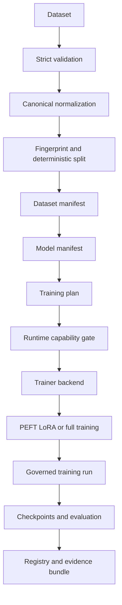

# Architecture

TuneForge separates deterministic domain logic from library integrations and external interfaces. Pydantic models define the contract; SQLite stores metadata; artifact files remain inside a configured root.

Core modules:

- `dataset.py`: bounded intake, schema policy, canonical records, duplicates, leakage, splits, quality, and tokenization analysis.
- `modeling.py`, `runtime.py`, `planning.py`: local model construction, PEFT integration, capabilities, estimates, and executable plans.
- `training.py`, `checkpoints.py`: lifecycle-controlled direct PyTorch training and safe checkpoint governance.
- `storage.py`: migration-backed SQLite repository for metadata and measured results.
- `evaluation.py`, `registry.py`, `evidence.py`: deterministic evaluation, evidence-gated registry, and exports.
- `api.py`, `cli.py`: local interfaces over the same domain functions.

The `TrainerBackend` contract leaves room for a future documented Transformers or TRL integration. v0.1 uses the governed direct PyTorch backend so CI proves every optimizer step without network access.

VLM modality types and schema boundaries are represented, but no image processor or multimodal trainer is supplied. This boundary prevents a configuration abstraction from being misrepresented as working VLM training.
